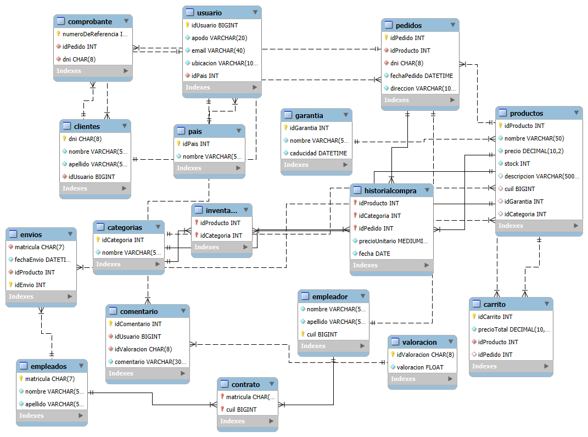

# Vista Previa de la Base de Datos

## DER:


## Consultas SQL: 


### 1) Escribe una consulta que muestre el nombre y apellido de cada cliente junto con el número total de pedidos que ha realizado. Agrupa los resultados por el dni del cliente.

```sql
SELECT Categorias.nombre, COUNT(Productos.idProducto) AS total_productos
FROM Categorias
LEFT JOIN Productos ON Categorias.idCategoria = Productos.idCategoria
GROUP BY Categorias.nombre;
```

### 2) Crea una consulta que muestre el nombre de cada categoría y el total de productos que pertenecen a ella. Agrupa por el nombre de la categoría.

```sql
SELECT Categorias.nombre, COUNT(Productos.idProducto) AS total_productos
FROM Categorias
LEFT JOIN Productos ON Categorias.idCategoria = Productos.idCategoria
GROUP BY Categorias.nombre;
```

### 3) Escribe una consulta que muestre el nombre de cada empleador junto con el total de productos que ha registrado cuyo precio esté entre $100 y $500. Agrupar por el cuil.

```sql
SELECT Empleador.nombre, Empleador.apellido, COUNT(Productos.idProducto) AS total_productos
FROM Empleador
LEFT JOIN Productos ON Empleador.cuil = Productos.cuil
WHERE Productos.precio BETWEEN 100 AND 500
GROUP BY Empleador.cuil;

```

### 4) Escribe una consulta que devuelva el apodo de cada usuario y la valoración promedio de sus comentarios, siempre que la valoración sea mayor a 3. Agrupar los resultados por id usuario

```sql
SELECT Usuario.apodo, AVG(Valoracion.valoracion) AS valoracion_promedio
FROM Usuario
JOIN Comentario ON Usuario.idUsuario = Comentario.idUsuario
JOIN Valoracion ON Comentario.idValoracion = Valoracion.idValoracion
WHERE Valoracion.valoracion > 3
GROUP BY Usuario.idUsuario;
```

### 5) Escribe una consulta que muestre el nombre y apellido de cada cliente junto con el monto total de sus pedidos, solo si ese total es mayor a $500. Utiliza LEFT JOIN para unir Clientes y Pedidos, y agrupa los resultados por dni del cliente. Asegúrate de aplicar la condición del monto mínimo.

```sql
SELECT Clientes.nombre, Clientes.apellido, SUM(Productos.precio) AS monto_total
FROM Clientes
LEFT JOIN Pedidos ON Clientes.dni = Pedidos.dni
LEFT JOIN Productos ON Pedidos.idProducto = Productos.idProducto
GROUP BY Clientes.dni
HAVING monto_total > 500;

```

## Consultas DML:

### 1) Crear un nuevo país y dar de alta un usuario

```sql
-- Crear un nuevo país
INSERT INTO Pais (idPais, nombre) VALUES (3, 'País Inventado');

-- Dar de alta un usuario afiliado a este país, con id 3, un email y ubicación especificada
INSERT INTO Usuario (idUsuario, apodo, email, ubicacion, idPais) 
VALUES (3, 'ApodoEjemplo', 'ejemplo@correo.com', 'Institución Escolar', 3);
```