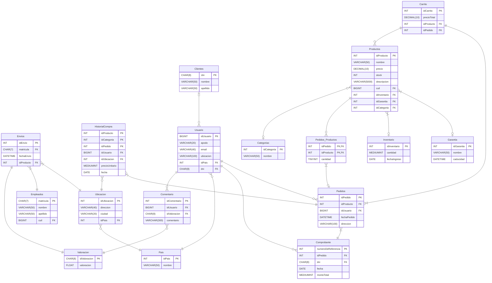

<h1 align = "center">BD_TiendaOnline.</h1>
<br>

<div align = "center">

# ¿Quienes participaron en su creación? 

</div>

- ### Martinez Alina.
- ### Casimiro Enzo.
- ### Zerpa Sebastian.


## Veamos el DER de nuestra base de datos, para asi sintetizar y brindarles el contenido que ofrece:

<div align = "center">



</div>


## Un par de consultas Ejemplo sobre nuestra base de datos: 


### 1) Escribe una consulta que muestre el nombre del usuario junto con el número total de pedidos que ha realizado.

```sql
SELECT
	U.apodo AS Usuario,
	COUNT(p.idPedido) AS Total
FROM Usuario U
JOIN Pedidos p ON U.idUsuario = p.idUsuario 
GROUP BY U.idUsuario;

```

### 2) Escribe una consulta que muestre el nombre de cada empleador junto con el total de productos que ha registrado cuyo precio esté entre $100 y $500. 

```sql
SELECT E.nombre, COUNT(P.idProducto) AS Total
FROM Empleador E
LEFT JOIN Productos P ON E.cuil = P.cuil
WHERE P.precio BETWEEN 100 AND 500
GROUP BY E.cuil;

```

### 3) Escribe una consulta que devuelva el apodo de cada usuario y la valoración promedio de sus comentarios, siempre que la valoración sea mayor a 3. Ordenar de mayor a menor.


```sql
SELECT U.apodo, AVG(V.valoracion)
FROM Usuario U
INNER JOIN Comentario C ON U.idUsuario = C.idUsuario
INNER JOIN Valoracion V ON V.idValoracion = C.idValoracion
WHERE V.valoracion > 3
GROUP BY apodo, V.idValoracion
ORDER BY valoracion DESC;

```

### 4) Escribe una consulta que muestre el apodo de cada usuario junto con el monto total de sus pedidos, solo si ese total es mayor a $500. Utiliza LEFT JOIN para unir Usuario y Pedidos. Ordenar de mayor a menor.

```sql
SELECT U.apodo AS Categoria, P.total AS Vendidos
FROM Usuario U
LEFT JOIN Pedidos P ON U.idUsuario = P.idUsuario
WHERE P.total > 500
ORDER BY total_vendidos DESC;

```

### 5) Obtener el apodo del usuario, el total de productos diferentes que ha comprado, el valor promedio de los productos comprados, y la cantidad total de pedidos realizados por cada usuario. Incluir también a aquellos usuarios que no hayan realizado pedidos. Mostrar solo los usuarios que han comprado más de 2 productos diferentes y cuyo promedio de precio de los productos comprados sea superior a $50. Ordenar el resultado de mayor a menor en base al total de productos diferentes.

```sql
SELECT U.apodo AS Apodo,
   	COUNT(DISTINCT PeP.idProducto) AS ProductosD,
   	AVG(P.total) AS Promedio,
   	COUNT(P.`idPedido`) AS Total
FROM Usuario U
LEFT JOIN Pedidos P ON P.idUsuario = P.idUsuario
LEFT JOIN Pedidos_Productos PeP ON P.idPedido = PeP.idPedido
LEFT JOIN Productos Pr ON PeP.idProducto = Pr.idProducto
WHERE PeP.idProducto IS NOT NULL
GROUP BY U.idUsuario
HAVING ProductosD > 2 AND Promedio > 50 OR COUNT(P.idPedido) = NULL
ORDER BY ProductosD DESC;

```
