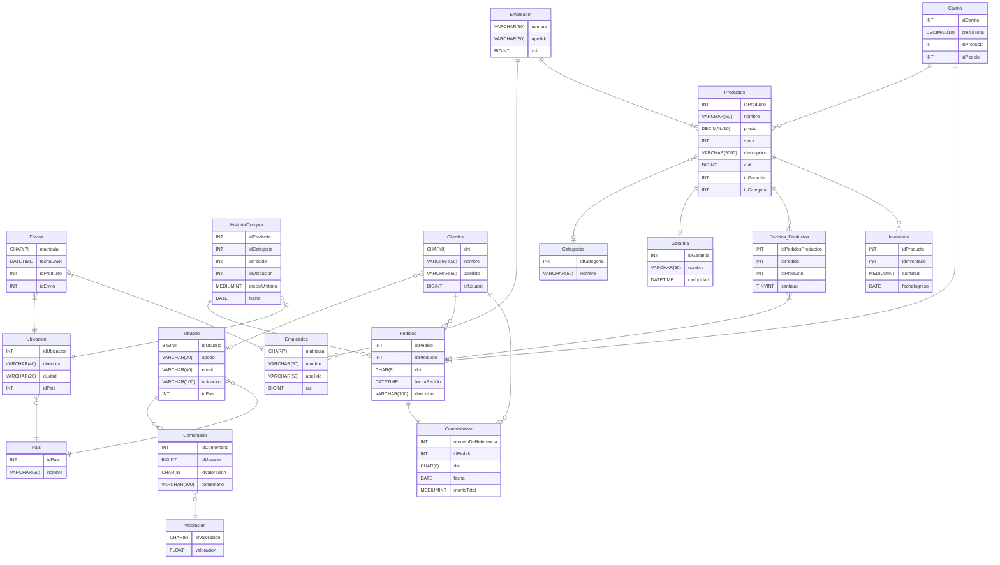

# Base De Datos: Tienda Online.

## Participantes

### Paetz Rodolfo.
### Alina Martinez.
### Casimiro Enzo.
### Zerpa Sebastian.


## DER:



```mermaid
erDiagram

    Envios {
        CHAR(7) matricula
        DATETIME fechaEnvio
        INT idProducto
        INT idEnvio
    }

    HistorialCompra {
        INT idProducto
        INT idCategoria
        INT idPedido
        INT idUbicacion
        MEDIUMINT precioUnitario
        DATE fecha
    }

    Clientes {
        CHAR(8) dni
        VARCHAR(50) nombre
        VARCHAR(50) apellido
        BIGINT idUsuario
    }

    Valoracion {
        CHAR(8) idValoracion
        FLOAT valoracion
    }

    Pedidos {
        INT idPedido
        INT idProducto
        CHAR(8) dni
        DATETIME fechaPedido
        VARCHAR(100) direccion
    }

    Productos {
        INT idProducto
        VARCHAR(50) nombre
        DECIMAL(10) precio
        INT stock
        VARCHAR(5000) descripcion
        BIGINT cuil
        INT idGarantia
        INT idCategoria
    }

    Ubicacion {
        INT idUbicacion
        VARCHAR(40) direccion
        VARCHAR(20) ciudad
        INT idPais
    }

    Pais {
        INT idPais
        VARCHAR(50) nombre
    }

    Inventario {
        INT idProducto
        INT idInventario
        MEDIUMINT cantidad
        DATE fechaIngreso
    }

    Usuario {
        BIGINT idUsuario
        VARCHAR(20) apodo
        VARCHAR(40) email
        VARCHAR(100) ubicacion
        INT idPais
    }

    Empleados {
        CHAR(7) matricula
        VARCHAR(50) nombre
        VARCHAR(50) apellido
        BIGINT cuil
    }

    Empleador {
        VARCHAR(50) nombre
        VARCHAR(50) apellido
        BIGINT cuil
    }

    Comprobante {
        INT numeroDeReferencia
        INT idPedido
        CHAR(8) dni
        DATE fecha
        MEDIUMINT montoTotal
    }

    Pedidos_Productos {
        INT idPedidosProductos
        INT idPedido
        INT idProducto
        TINYINT cantidad
    }

    Categorias {
        INT idCategoria
        VARCHAR(50) nombre
    }

    Comentario {
        INT idComentario
        BIGINT idUsuario
        CHAR(8) idValoracion
        VARCHAR(300) comentario
    }

    Carrito {
        INT idCarrito
        DECIMAL(10) precioTotal
        INT idProducto
        INT idPedido
    }

    Garantia {
        INT idGarantia
        VARCHAR(50) nombre
        DATETIME caducidad
    }

    Envios }|--|| Ubicacion : ""
    Envios }|--|| Empleados: ""
    HistorialCompra ||--o{ Pedidos : ""
    HistorialCompra }o--|| Ubicacion : ""
    Clientes }o--o| Usuario : ""
    Clientes ||--o{ Pedidos : ""
    Clientes ||--o{ Comprobante : ""
    Productos }o--o| Categorias : ""
    Productos ||--o| Garantia : ""
    Productos ||--o{ Pedidos_Productos: ""
    Pedidos_Productos }|--o| Pedidos : ""
    Pedidos ||--|| Comprobante : ""
    Usuario ||--o{ Comentario : ""
    Usuario }o--|| Pais : ""
    Comentario }o--|| Valoracion : ""
    Empleador ||--o{ Empleados : ""
    Empleador ||--|{ Productos: ""
    Ubicacion }o--|| Pais : ""
    Productos ||--o{ Inventario : ""
    Carrito ||--o{ Productos : ""
    Carrito ||--|{ Pedidos : ""
```

## Consultas SQL: 


### 1) Escribe una consulta que muestre el nombre y apellido de cada cliente junto con el número total de pedidos que ha realizado. Agrupa los resultados por el dni del cliente.

```sql
SELECT
	c.nombre AS nombre_cliente,
	c.apellido AS apellido_cliente,
	COUNT(p.idPedido) AS total_pedidos
FROM Clientes c
JOIN Pedidos p ON c.dni = p.dni 
GROUP BY c.dni;

```

### 2) Escribe una consulta que muestre el nombre de cada empleador junto con el total de productos que ha registrado cuyo precio esté entre $100 y $500. Agrupar por el cuil.

```sql
SELECT
    c.nombre AS nombre_categoria, 
    COUNT(p.idProducto) AS total_productos
FROM Categorias c
JOIN Productos p ON c.idProducto = p.idProducto
GROUP BY c.nombre;

```

### 3) Escribe una consulta que devuelva el apodo de cada usuario y la valoración promedio de sus comentarios, siempre que la valoración sea mayor a 3. Agrupar los resultados por id usuario.

```sql
SELECT E.nombre, E.apellido, COUNT(P.idProducto) AS total_productos
FROM Empleador E
LEFT JOIN Productos P ON E.cuil = P.cuil
WHERE P.precio BETWEEN 100 AND 500
GROUP BY E.cuil;

```

### 4) Escribe una consulta que muestre el nombre y apellido de cada cliente junto con el monto total de sus pedidos, solo si ese total es mayor a $500. Utiliza LEFT JOIN para unir Clientes y Pedidos, y agrupa los resultados por dni del cliente. Asegúrate de aplicar la condición del monto mínimo.

```sql
SELECT C.nombre AS nombre_categoria, COUNT(Pedidos_Productos.idProducto) AS total_vendidos
FROM Categorias C
INNER JOIN Productos P ON C.idCategoria = P.idCategoria
INNER JOIN Pedidos_Productos PeP ON P.idProducto = PeP.idProducto
GROUP BY C.idCategoria
ORDER BY total_vendidos DESC;

```

### 5) Obtener el nombre del cliente, el total de productos diferentes que ha comprado, el valor promedio de los productos comprados, y la cantidad total de pedidos realizados por cada cliente. Incluir también a aquellos clientes que no hayan realizado pedidos. Mostrar solo los clientes que han comprado más de 2 productos diferentes y cuyo promedio de precio de los productos comprados sea superior a $50. Ordenar el resultado de mayor a menor en base al total de productos diferentes.


```sql
SELECT C.nombre AS nombre_cliente,
   	C.apellido AS apellido_cliente,
   	COUNT(DISTINCT PeP.idProducto) AS productos_diferentes,
   	AVG(Pr.precio) AS promedio_precio,
   	COUNT(P.idPedido) AS total_pedidos
FROM Clientes C
LEFT JOIN Pedidos P ON C.dni = P.dni
LEFT JOIN Pedidos_Productos PeP ON P.idPedido = PeP.idPedido
LEFT JOIN Productos Pr ON PeP.idProducto = Pr.idProducto
WHERE Pr.precio IS NOT NULL
GROUP BY Clientes.dni
HAVING productos_diferentes > 2 AND promedio_precio > 50
ORDER BY productos_diferentes DESC;

```
