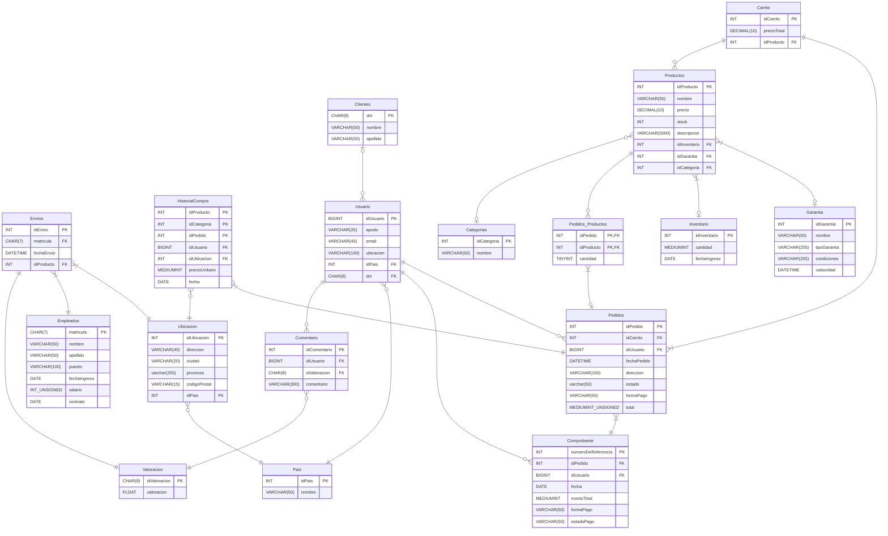

<h1 align = "center">BD_TiendaOnline.</h1>
<br>

<div align = "center">

# ¿Quienes participaron en su creación? 

</div>

- ### Martinez Alina.
- ### Casimiro Enzo.
- ### Zerpa Sebastian.


## Veamos el DER de nuestra base de datos, para asi sintetizar y brindarles el contenido que ofrece:

<div align = "center">



</div>


## Un par de consultas Ejemplo sobre nuestra base de datos: 


### 1) Escribe una consulta que muestre el nombre del usuario junto con el número total de pedidos que ha realizado.

```sql
SELECT
	U.apodo AS Usuario,
	COUNT(p.idPedido) AS Total
FROM Usuario U
JOIN Pedidos p ON U.idUsuario = p.idUsuario 
GROUP BY U.idUsuario;

```

### 2)Mostrá los 3 productos que más se vendieron (según cantidad de veces que aparecen en pedidos) junto con:

    su nombre

    el número de veces vendido

    el precio unitario promedio

    y el total recaudado (precio unitario × veces vendido)
```sql
SELECT 
    P.nombre AS Producto,
    COUNT(H.idProducto) AS VecesVendido,
    AVG(H.precioUnitario) AS PrecioPromedio,
    SUM(H.precioUnitario) AS TotalRecaudado
FROM HistorialCompra H
JOIN Productos P ON H.idProducto = P.idProducto
GROUP BY H.idProducto, P.nombre
ORDER BY VecesVendido DESC
LIMIT 3;


```

### 3) Escribe una consulta que devuelva el apodo de cada usuario y la valoración promedio de sus comentarios, siempre que la valoración sea mayor a 3. Ordenar de mayor a menor.


```sql
SELECT U.apodo, AVG(V.valoracion) AS PromedioValoracion
FROM Usuario U
INNER JOIN Comentario C ON U.idUsuario = C.idUsuario
INNER JOIN Valoracion V ON V.idValoracion = C.idValoracion
WHERE V.valoracion > 3
GROUP BY U.apodo
ORDER BY PromedioValoracion DESC;

```

### 4) Escribe una consulta que muestre el apodo de cada usuario junto con el monto total de sus pedidos, solo si ese total es mayor a $500. Utiliza LEFT JOIN para unir Usuario y Pedidos. Ordenar de mayor a menor.

```sql
SELECT U.apodo AS Usuario, SUM(P.total) AS TotalPedidos
FROM Usuario U
LEFT JOIN Pedidos P ON U.idUsuario = P.idUsuario
GROUP BY U.apodo
HAVING SUM(P.total) > 500
ORDER BY TotalPedidos DESC;

```

### 5) Obtener el apodo del usuario, el total de productos diferentes que ha comprado, el valor promedio de los productos comprados, y la cantidad total de pedidos realizados por cada usuario. Incluir también a aquellos usuarios que no hayan realizado pedidos. Mostrar solo los usuarios que han comprado más de 2 productos diferentes y cuyo promedio de precio de los productos comprados sea superior a $50. Ordenar el resultado de mayor a menor en base al total de productos diferentes.

```sql
SELECT 
    U.apodo AS Apodo,
    COUNT(DISTINCT Pr.idProducto) AS ProductosDiferentes,
    AVG(Pr.precio) AS PromedioPrecioProductos,
    COUNT(DISTINCT P.idPedido) AS TotalPedidos
FROM Usuario U
LEFT JOIN Pedidos P ON U.idUsuario = P.idUsuario
LEFT JOIN Pedidos_Productos PP ON P.idPedido = PP.idPedido
LEFT JOIN Productos Pr ON PP.idProducto = Pr.idProducto
GROUP BY U.idUsuario
HAVING ProductosDiferentes > 2 AND PromedioPrecioProductos > 50
ORDER BY ProductosDiferentes DESC;

```
